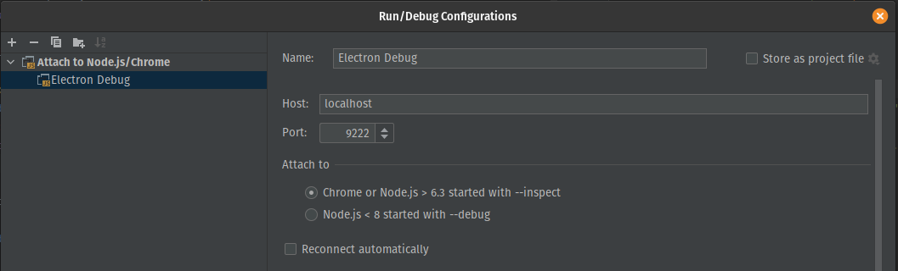

# React Electron Template

## Overview
Setup instructions and demo app for creating an electron app with react.
Includes creation instructions and debug setup for Webstorm.

## Setup Instructions
```
yarn create react-app my-app
yarn add electron electron-builder electron-is-dev
yarn add concurrently wait-on
```

Add the following to package.json:
```
"main": "public/electron.js"
```

Add a build and dev script that starts debug on port 9222:
```
"scripts": {
  ... other script
  "ebuild": "yarn run build && node_modules/.bin/build",
  "dev": "concurrently \"yarn start\" \"wait-on http://localhost:3000 && electron --remote-debugging-port=9222 .\""
}
```

Add a .env file with the following to disable browser popup:
```
BROWSER=none
```

Add a _/electron_ directory in the project root
```
react-electron-template
|
 --electron
|
 --public
|
 --src
```

Create a file _/electron/main.js_ and add the contents found in this project
```
/electron/main.js
```

Add the following properties to _package.json_:
```
"homepage": "./",
"main": "./electron/main.js"
```

To debug, start app from terminal with:
```
yarn run dev
```

Remote debug in webstorm using setup below:

